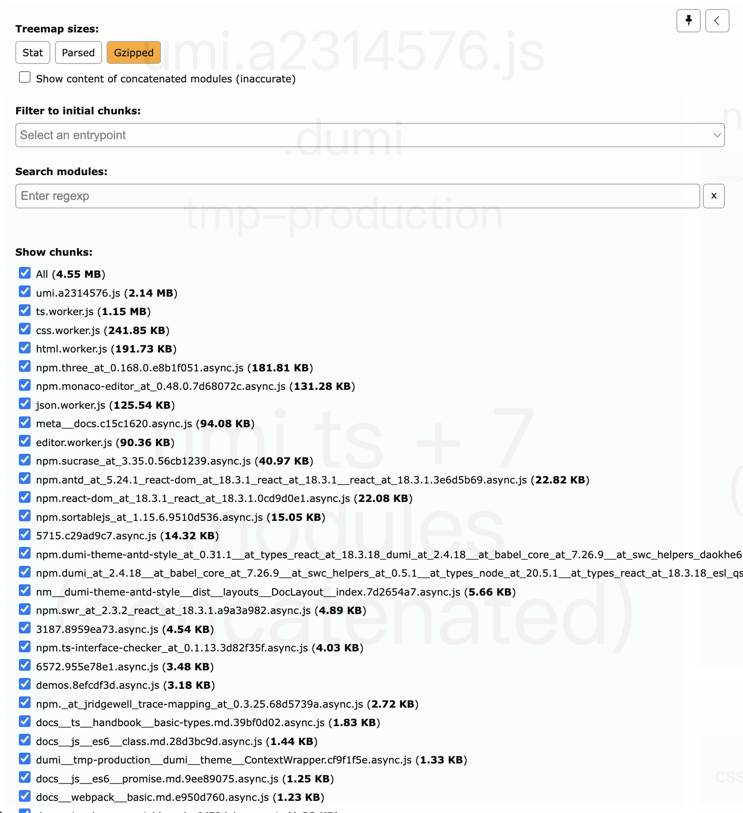
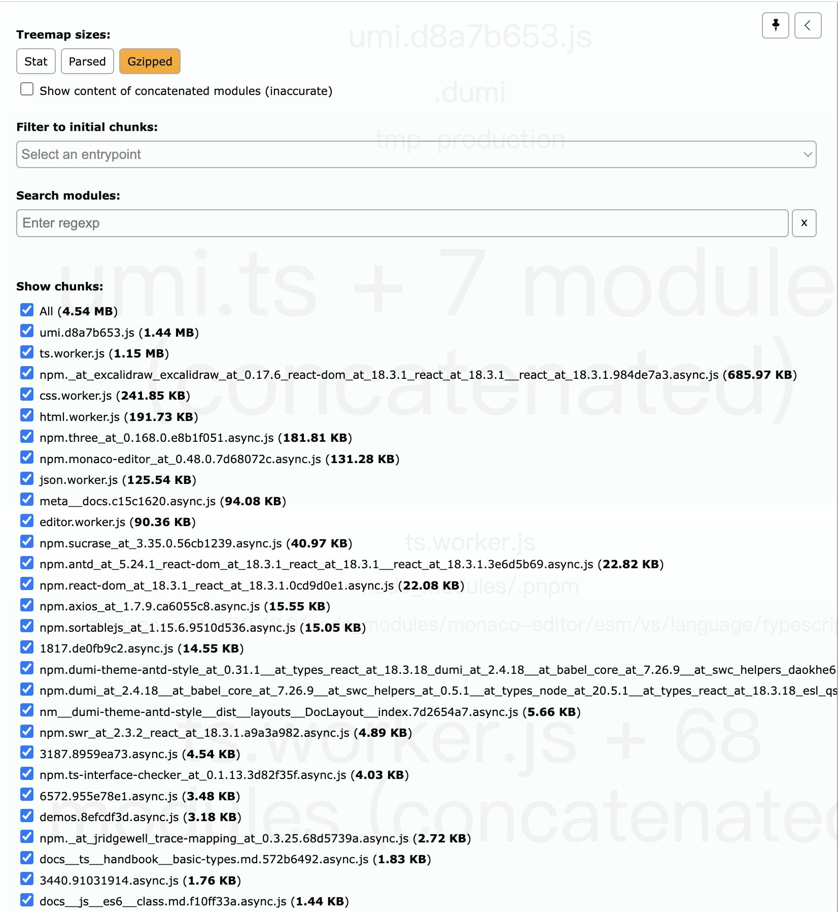
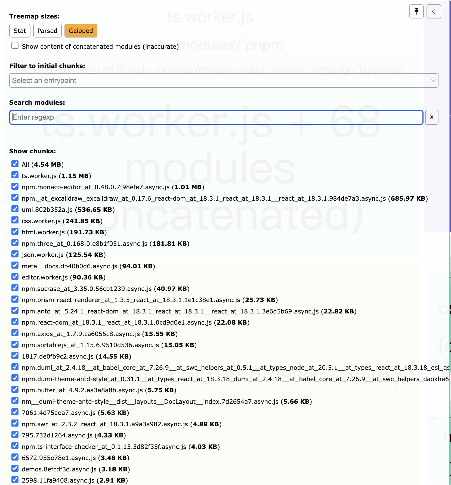

自己基于`dumi`的主题，新增了一些扩展的功能，其中包括

- monaco-editor: 显示代码
- Excalidraw: 显示画图
- ...

其中`monaco-editor`和`Excalidraw`打包后内容比较大，导致部署后加载时间比较长，并且由于`Money`原因，还是部署在`vercel`上, 加载时间就更加长了
为了首次加载数据，必要的优化还是需要的.

## 分析历程

首先，我也并不知道是`monaco-editor`和`Excalidraw`的原因，只是在打包的时候, `dumi`提示


```shell
The bundle size is significantly larger than recommended.
Consider reducing it with code splitting:  https://umijs.org/blog/code-splitting
You can also analyze the project dependencies:  https://umijs.org/docs/guides/env-variables#analyze
```

在项目根目录创建`.env`文件, 并添加以下内容

```shell
ANALYZE=1 umi build
```

然后在重新进行打包编译， 编译后可以通过[http://127.0.0.1:8888/](http://127.0.0.1:8888/)查看代码分析, 就看最大的文件, 然后定位到是这两个导致的

## 优化结果

在最初未进行优化前，打包再`Gzip`压缩后大小如下



将`Excalidraw`处理后，重新运行打包, 打包后大小如下



再将`monaco-editor`处理后，重新运行打包, 打包后大小如下



可以看到`umi.[hash].js`文件从`2.14MB` --> `1.44MB`  --> `537kb`

:::info
只是将打包文件进行了拆分, 并没有改变打包后总文件的大小，只是首页加载的文件减小了(或分多文件加载),实现加载数据变快的效果 
:::

## 优化策略

### 代码分割

- 组件懒加载

```typescript jsx
const LazyComponent = React.lazy(() => import('./LazyComponent'));

function MyComponent() {
  return (
    <React.Suspense fallback={<div>Loading...</div>}>
      <LazyComponent />
    </React.Suspense>
  );
}
```

例如`monaco-editor`组件

:::code-group

```typescript jsx [SourceCode]
import {
  ISourceCodeProps,
} from 'dumi/theme-default/builtins/SourceCode';
import React, { lazy, Suspense, useEffect, useRef } from 'react';

interface SourceCodeProps extends ISourceCodeProps {
  monacoEditor?: boolean;
}

const LazySourceCode = lazy(() => import('./LazySourceCode'))

const SourceCode: React.FC<SourceCodeProps> = (props) => {

  return (
    <Suspense fallback={ <div>loading...</div> }>
      <LazySourceCode { ...props } />
    </Suspense>
  );
};

export default SourceCode;

```

```typescript jsx [LazySourceCode]
import OriginSourceCode, {
  ISourceCodeProps,
} from 'dumi/theme-default/builtins/SourceCode';
import * as monaca from 'monaco-editor';
import React, { useEffect, useRef } from 'react';
import { useStyles } from './style';
import { Tabs } from "antd";
import { LanguageIcon } from "../../components/languageIcon";

interface SourceCodeProps extends ISourceCodeProps {
  monacoEditor?: boolean;
}

const LazySourceCode: React.FC<SourceCodeProps> = (props) => {
  const { styles } = useStyles();
  if (!props.monacoEditor) {
    if (props.title) {
      const items = [
        {
          key: props.title,
          label: <LanguageIcon name={ props.title }/>,
          children: <OriginSourceCode { ...props }>{ props.children }</OriginSourceCode>,
        }
      ]
      return <Tabs items={ items }/>;
    }
    return <OriginSourceCode { ...props }>{ props.children }</OriginSourceCode>;
  }
  const lineCount: number = props.children.split('\n').length;
  const languageMap: any = {
    ts: 'typescript',
    tsx: 'typescript',
  };
  const ref = useRef<any>(null);
  useEffect(() => {
    const editor = monaca.editor.create(ref.current, {
      value: props.children,
      language: languageMap[props.lang] || props.lang,
      readOnly: true,
      wordWrap: 'on',
      automaticLayout: true,
      scrollBeyondLastLine: false,
    });
    if (props.highlightLines) {
      const ranges: { startLineNumber: number; endLineNumber: number }[] = [];
      let currentLine: number = props.highlightLines[0];
      let index: number = 1;
      let start: number = currentLine;
      while (index < props.highlightLines.length) {
        if (props.highlightLines[index] === currentLine + 1) {
          index++;
        } else {
          ranges.push({ startLineNumber: start, endLineNumber: currentLine });
          start = props.highlightLines[index];
          currentLine = start;
          index++;
        }
      }
      ranges.push({ startLineNumber: start, endLineNumber: currentLine });
      editor.createDecorationsCollection(
        ranges.map((range) => {
          return {
            range: new monaca.Range(
              range.startLineNumber,
              1,
              range.endLineNumber,
              1,
            ),
            options: {
              isWholeLine: true,
              className: styles.myContentClass,
            },
          };
        }),
      );
    }
  }, []);
  const height = lineCount * 18 + 20;
  return (
    <pre
      style={ {
        height: `${ height > 500 ? 500 : height }px`,
        marginTop: 0,
      } }
      ref={ ref }
    ></pre>
  );
};

export default LazySourceCode;
```
:::

- 设置拆分策略

```typescript
export default defineConfig({
  codeSplitting: {
    jsStrategy: 'depPerChunk'
  }
})
```


- 压缩代码

这里并未使用

- Gzip压缩

部署后本身就是Gzip压缩, 所以已经做了
