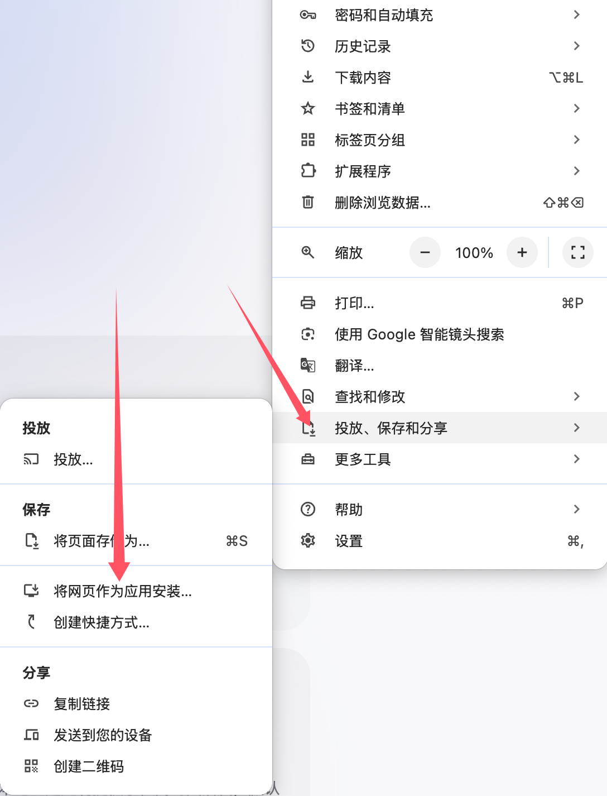

## 安装 workbox-webpack-plugin

首先，安装 workbox-webpack-plugin

```shell
pnpm add workbox-webpack-plugin
```

## 配置 DUmi 项目

在`dumirc.ts`中添加自定义`webpack`配置, 添加`workbox-webpack-plugin`：

```typescript
import { defineConfig } from 'dumi';


export default defineConfig({
  headScripts: [
    process.env.NODE_ENV !== 'development' ? `;(function () {
      if (!('serviceWorker' in navigator)) {
        console.log('Service workers not supported.')
        return
      }
      window.addEventListener('load', function () {
        // 这里的路径可以根据实际情况修改, 记住要https协议, 且www根据实际情况决定是否加
        var e = 'https://www.domain.com/service-worker.js?v=${Date.now()}'
        navigator.serviceWorker
          .register(e)
          .then(function (n) {
            n.onupdatefound = function () {
              var e = n.installing
              e.onstatechange = function () {
                switch (e.state) {
                  case 'installed':
                    navigator.serviceWorker.controller
                      ? console.log('New or updated content is available.')
                      : console.log('Content is now available offline!')
                    break
                  case 'redundant':
                    console.error(
                      'The installing service worker became redundant.'
                    )
                }
              }
            }
          })
          .catch(function (e) {
            console.error('Error during service worker registration:', e)
          })
      })
    })()` : '',
  ],
  chainWebpack(memo) {
    memo.plugin('monaco').use(new MonacoWebpackPlugin());
    if (process.env.NODE_ENV !== 'development') {
      const {GenerateSW} = require('workbox-webpack-plugin')
      const pkg = require('./package.json')
      memo.plugin('workbox').use(GenerateSW, [
        {
          // 缓存版本：建议增加一种缓存版本标识符的设定，不一定是 pkg.name 和 version 一起的，可能是和你的基建环境变量或者 timestamp 等相关的，看你自己设定。
          cacheId: `${pkg.name}-${pkg.version}`,
          clientsClaim: true,
          skipWaiting: true,
          // 这里 exclude 的区别：通常来说 workbox 插件会自动识别 webpack 产物列表，然后自动添加产物的那些文件到 cache 列表中，你可以在 service-worker.js 这个产物中看到缓存文件列表，此时配 exclude: [/\.html/] 只排除 html 就行了。
          exclude: [/\.html/]
        }
      ])
    }
  }
});
```

## 创建 manifest.json

在`public`目录下创建`manifest.json`文件，内容如下：

```json
{
  "name": "nyx",
  "short_name": "nyx",
  "icons": [
    {
      "src": "/assets/icons/android-chrome-192x192.png",
      "sizes": "192x192",
      "type": "image/png"
    },
    {
      "src": "/assets/icons/android-chrome-512x512.png",
      "sizes": "512x512",
      "type": "image/png"
    }
  ],
  "theme_color": "#ffffff",
  "background_color": "#ffffff",
  "display": "standalone"
}
```

## 添加图标

在`public/assets/icons`目录下添加对应的图标文件， 确保和`manifest.json`中的`src`字段对应。

## 将`manifest.json`添加到`index.html`中

由于`dumi.js`没有`index.html`文件， 这里有两种思路

1. 打包生成`index.html`文件，然后通过脚本把`<link rel="manifest" href="/manifest.json">`添加到`index.html`中。
2. 在`headScripts`中添加`manifest.json`的引用，这样`dumi.js`会自动添加到`index.html`中。

这里是第二种思路，在`dumirc.ts`中添加`headScripts`配置：

```typescript
import { defineConfig } from 'dumi';

export default defineConfig({
  headScripts: [
      `;(function(){
      const manifestLink = document.createElement('link');
      manifestLink.rel = 'manifest';
      manifestLink.href = '/manifest.json';
      document.head.appendChild(manifestLink);
    })()`,
  ]
});
```

## 部署

部署到服务器上, 通过浏览器打开, 可以看到如下表示配置成功：



:::info{title=注意}
只有在`https`协议下才能使用`serviceWorker`，所以你需要确保你的网站部署在`https`协议下。本地开发环境下，`serviceWorker`不会生效，也可能是我配置的有问题。
:::
