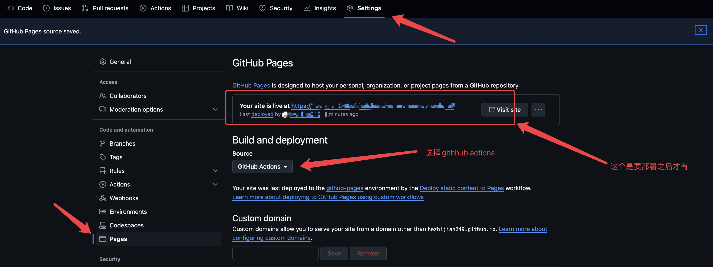
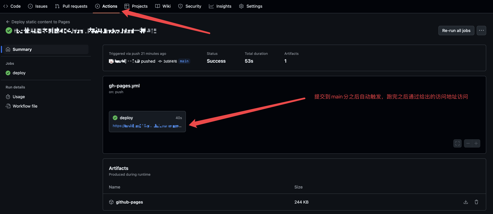

## 介绍

本指南将指导你如何将你前端的项目部署到 GitHub Pages, 下面以一个 Vue 项目为例。

## 步骤

### 开启 GitHub Pages

1. 进入仓库，点击`Settings`，然后点击`Pages`菜单 。
2. 将`Build and deployment`的`Source`选择为`GitHub Pages`，然后点击`Save`。



### 使用 workflow 自动部署

GitHub Pages 支持使用 workflow 自动部署，只需要在仓库根目录下创建一个`.github/workflows/gh-pages.yml`文件，并添加以下内容：

```yaml
# 将静态内容部署到 GitHub Pages 的简易工作流程
name: Deploy static content to Pages

on:
  # 仅在推送到默认分支时运行。
  push:
    branches: ['main']

  # 这个选项可以使你手动在 Action tab 页面触发工作流
  workflow_dispatch:

# 设置 GITHUB_TOKEN 的权限，以允许部署到 GitHub Pages。
permissions:
  contents: read
  pages: write
  id-token: write

# 允许一个并发的部署
concurrency:
  group: 'pages'
  cancel-in-progress: true

jobs:
  # 单次部署的工作描述
  deploy:
    environment:
      name: github-pages
      url: ${{ steps.deployment.outputs.page_url }}
    runs-on: ubuntu-latest
    steps:
      - name: Checkout
        uses: actions/checkout@v4
      - name: 设置node环境
        uses: actions/setup-node@v4
        with:
          node-version: 20.x
      - name: 设置pnpm环境
        uses: pnpm/action-setup@v4
        with:
          version: 9
      - name: 安装依赖
        run: pnpm install
      - name: Build
        run: pnpm run build
      - name: Setup Pages
        uses: actions/configure-pages@v4
      - name: Upload artifact
        uses: actions/upload-pages-artifact@v3
        with:
          # Upload dist folder
          path: './dist'
      - name: Deploy to GitHub Pages
        id: deployment
        uses: actions/deploy-pages@v4
```

代码在提交或者合并到`main`分支时自动运行，并将`dist`目录下的静态文件部署到 GitHub Pages。



## 出现的问题

### 访问 404

由于项目名并不叫做`<USERNAME>.github.io`，而是叫其他的名字，所以访问`https://<USERNAME>.github.io/<PROJECT_NAME>`会出现 404 错误。

解决方法：

在`vite.config.ts`中配置`base`属性

```typescript
import { defineConfig } from 'vite';

export default defineConfig({
  // 设置 base 路径, PROJECT_NAME替换为你的项目名
  base: '/<PROJECT_NAME>/',
});
```

### 子页面刷新后 404

在部署界面之后，进入首页刷新可以正常进去，界面点击叶可以正常跳转，但是刷新子页面会出现 404 错误。

解决方法：

在`index.html`所在目录下直接添加一个内容与之相同的`404.html`， 由于每次打包后的`index.html`都不一样，所以这里通过脚本自动生成一个`404.html`文件, 在`scripts`目录下创建`create-404.js`文件，内容如下。

```javascript
import fs from 'fs';
import path from 'path';
import { fileURLToPath } from 'url';

const __filename = fileURLToPath(import.meta.url);
const __dirname = path.dirname(__filename);

const distPath = path.join(__dirname, '../dist');
const indexHtmlPath = path.join(distPath, 'index.html');
const notFoundHtmlPath = path.join(distPath, '404.html');

fs.createReadStream(indexHtmlPath).pipe(fs.createWriteStream(notFoundHtmlPath));
```

将`package.json`中的`build`脚本修改为：

```json
{
  "scripts": {
    "build": "run-p type-check \"build-only {@}\" -- && node scripts/create-404.js"
  }
}
```
