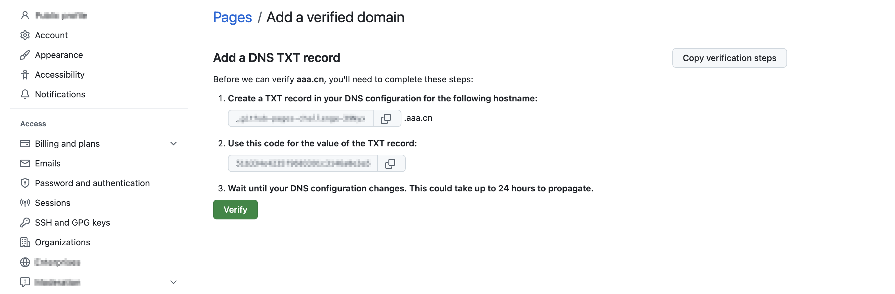
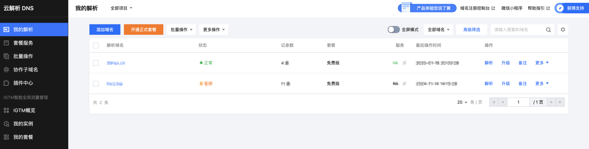
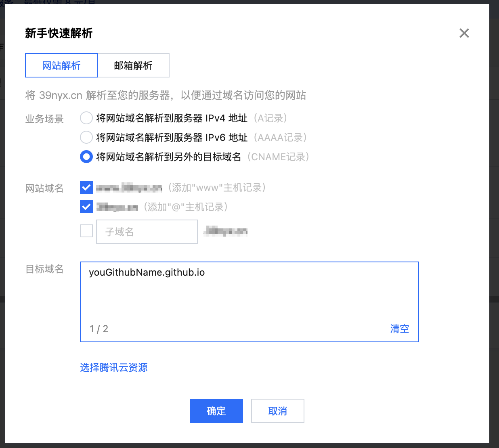
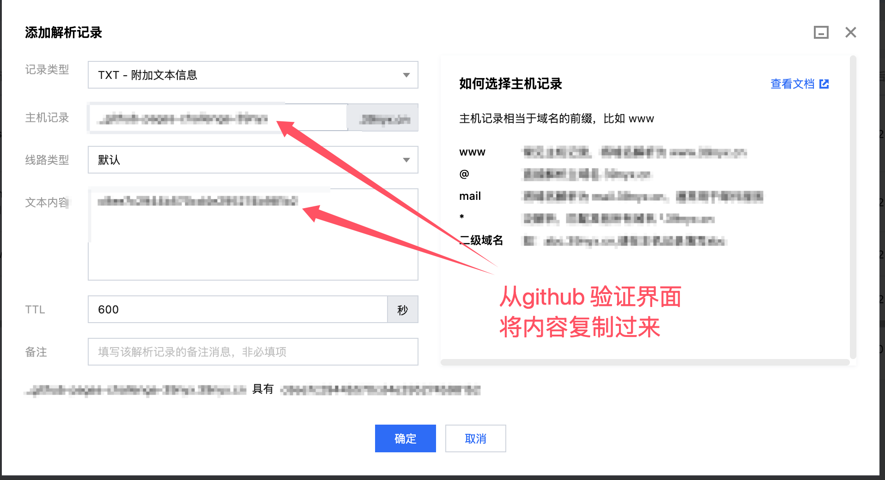
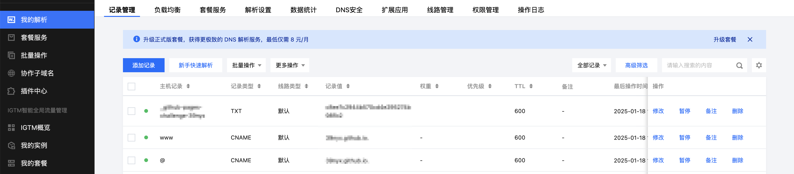
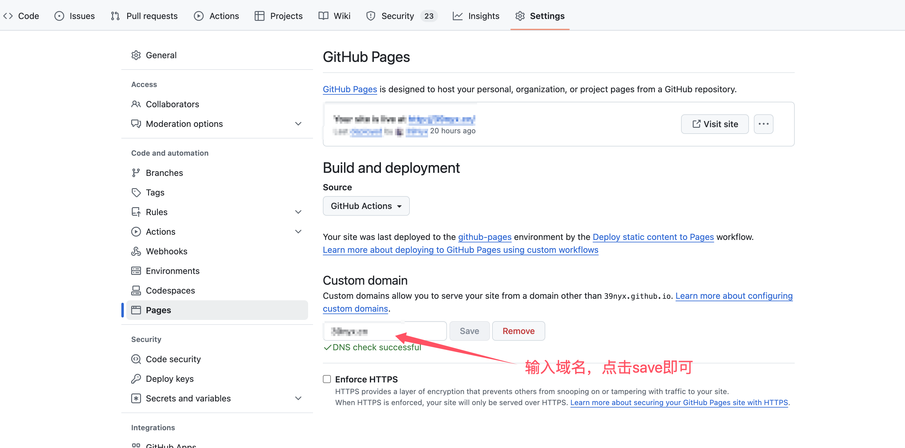

## 购买域名

域名的话我在`阿里云`和`腾讯云`看了一下，我想购买的名称腾讯云比阿里云便宜了2块钱，所以我毫不犹豫的选择了腾讯云, 毕竟2块钱也是钱。

购买域名后等待审核通过即可。

## github page绑定域名

在`github`点击头像，然后选择`Settings`， 然后选择[pages](https://github.com/settings/pages)菜单, 点击`Add a domain`按钮
输入购买的域名，然后点击`Add domain`, 进入到验证域名的界面

在这个界面，会提示你添加`CNAME`记录, 表示这个域名是你的

这时需要去腾讯云的域名解析界面, 添加一条记录, 用于给`github`进行域名验证

## 域名解析

在等待审核通过的时候，可以去[云解析 DNS](https://console.cloud.tencent.com/cns)界面, 可以看到自己注册的域名， 在操作列, 点击解析按钮
进入解析配置界面

点击`新手快速解析`按钮, 业务场景选择`将网站域名解析到另外的目标域名`, 也就是`CNAME记录`， 网站域名勾选第一个和第二个即可, 目标域名填写
`<username>.github.io` 点击`确定`按钮, 等待解析生效即可。

再添加一条记录`TXT`记录, 用于验证域名

最终内容如下所示, 一共有三条记录, 其中`@`和`www`的`CNAME`记录是为了方便访问, 而`TXT`记录是用于验证域名的

配置好之后, 再回到`github 添加域名的界面`点击`验证`按钮

最后, 在`<username>.github.io`项目，选择`Settings` ---> `Pages`， 然后将`Custom domain`输入框输入自己的域名，点击`save`按钮即可。

图片上没勾选`Enforce HTTPS `选项, 只是截图没有勾选, 其实是勾选了的

等待一段时间，等待域名解析生效, 就可以通过自己的域名访问`github page`了。

## 问题

### 域名解析生效时间

域名解析生效时间具体是多长我也不清楚，反正刚配置好是无法访问的，自己开了几把游戏回来看就可以了。

