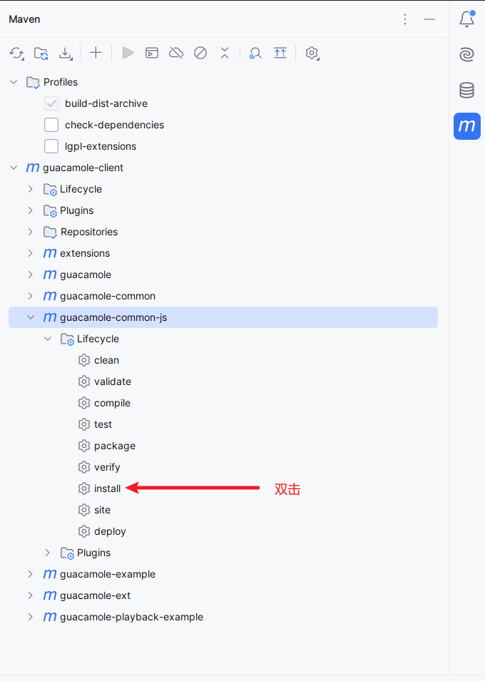

## 代码编译

克隆代码后, 使用`idea`打开, 安装依赖之后执行`install`



执行完成之后, 在`target/guacamole-common-js-1.5.5`目录下生成`all.js`和`all.min.js`文件，这两个文件就是我们需要的js文件。

在`all.js`文件末尾添加以下代码

```javascript
module.exports = Guacamole
```

## typescript支持

编译之后的文件是`js`文件, 在`ts`里面使用的时候, 会有一些问题, 在`src`的同级目录新建一个`all.d.ts`文件, 用于声明`all.js`里面的类型,
(其实就是我不会自动生成`d.ts`文件, 所以就只能手动写了, 用到啥就加啥, 主打一个不报错即可)

## 发布

将`package.json`文件改为以下内容

```json
{
  "name": "@39nyx/guacamole-common-js",
  "version": "1.0.0",
  "description": "Dependencies to be installed by Maven for running unit tests and generating documentation",
  "files": [
    "dist"
  ],
  "main": "dist/all.js",
  "module": "dist/all.js",
  "types": "dist/all.d.ts",
  "browserslist": {
    "production": [
      ">0.2%",
      "not dead",
      "not op_mini all"
    ],
    "development": [
      "last 1 chrome version",
      "last 1 firefox version",
      "last 1 safari version"
    ]
  },
  "devDependencies": {
    "jsdoc": "^4.0.2",
    "karma": "^6.4.1",
    "karma-firefox-launcher": "^2.1.2",
    "karma-jasmine": "^5.1.0"
  }
}
```

将`all.d.ts`文件和`all.js`文件复制到`dist`目录, 然后再执行`npm publish`发布到`npm`仓库即可

:::info
一般发布都是用`all.min.js`文件, 这里看个人需要
:::

## 使用

```shell [pnpm]
pnpm add @39nyx/guacamole-common-js
```

```typescript
import { Client } from '@39nyx/guacamole-common-js' // 这个需要配合all.d.ts文件才不会报错
// 或者
// import * from Guacamole from '@39nyx/guacamole-common-js'
```
