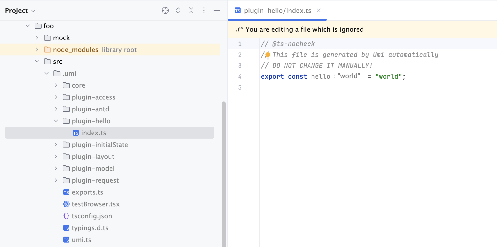
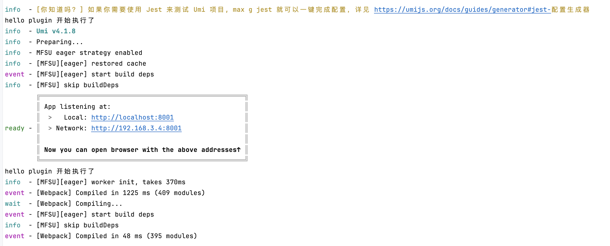

---
group:
  title: UMI 插件
  order: 1
title: 快速上手
order: 1
---

## 项目创建

先创建文件夹，然后进入文件夹，执行以下命令：

```bash
$ pnpm dlx create-umi@latest
Packages: +40
++++++++++++++++++++++++++++++++++++++++
Progress: resolved 40, reused 40, downloaded 0, added 40, done
┌   create-umi 
│
●  Pick Umi App Template
│  ○ Simple App
│  ○ Ant Design Pro
│  ○ Vue Simple App
│  ● Umi Plugin (for plugin development)
```

选择 Umi Plugin 模板，然后选择pnpm,在选择淘宝源，然后输入项目名称，即可创建 Umi 插件项目。

## 项目结构

<Tree>
  <ul>
    <li>
          <a>src</a>
          <ul>
            <li>
              <a>index.ts</a>
              <small>插件入口文件</small>
            </li>
          </ul>
        </li>
    <li>
      <a>.fatherrc.ts</a>
    </li>
    <li>
      <a>.ignore</a>
    </li>
    <li>
      <a>package.json</a>
    </li>
    <li>
      <a>README.md</a>
    </li>
    <li>
      <a>tsconfig.json</a>
    </li>
  </ul>
</Tree>


## 编写插件

在`src/index.ts`文件中编写插件逻辑，比如：

```typescript
import { IApi } from '@umijs/types';

export default (api: IApi) => {
  // See https://umijs.org/docs/guides/plugins
  api.describe({
    // 配置中该插件配置的键名, .umirc.ts中配置的键名也要和这里的key一致
    key: 'hello',
    config: {
      // 插件配置项的类型，这里是string类型
      schema(joi) {
        return joi.string();
      }
    },
    // 配置启用，只有配置插件的配置项才启用插件
    enableBy: api.EnableBy.config
  });

  api.onStart(() => {
    console.log('hello plugin 开始执行了');
  });

  api.onGenerateFiles(() => {
    api.writeTmpFile({
      path: 'index.ts',
      content: 'export const hello = "world";'
    });
  });
};
```

## 使用插件

创建一个简单的umi.js项目，继续创建一个新的文件夹, 然后执行`pnpm dlx create-umi@latest`命令，这里选择`Ant Design Pro`模板

由于我使用的是`pnpm workspace`，所以不发布插件，也可以直接在项目中安装插件：

<InstallDependencies pnpm="$ pnpm add --filter foo --workspace bar"></InstallDependencies>

其中`bar`是插件名，`foo`是项目名。更多`pnpm workspace`相关命令请参考[官方文档](https://pnpm.io/workspaces)。

在`.umirc.ts`中配置插件：

```typescript
export default {
  plugins: [
    'bar/src/index.ts', // 插件名/插件入口文件, 如果是发布的插件，则可以直接使用插件名，如：'bar'，这里使用相对路径
  ],
  // 这里的hello和api.describe方法key一致
  hello: 'world', // 插件配置
}
```

启动项目，可以看到控制台输出`hello plugin 开始执行了`，并且在`src/.umi`目录下生成了`plugin-hello/index.ts`文件。





随意在项目的任意位置，使用`hello`变量，可以看到输出`world`。

```typescript jsx {2,7}
// 这里使用的是@umijs/max，固定的
import { hello } from '@umijs/max';

const HomePage: React.FC = () => {
  const { name } = useModel('global');
  // 随便打印一下hello变量的值，和.umirc.ts中配置的hello值一样
  console.log(hello);
  return (
    <PageContainer ghost>
      <div className={ styles.container }>
        <Guide name={ trim(name) } />
      </div>
    </PageContainer>
  );
};
```

## 总结

本文介绍了如何创建一个 Umi 插件项目，编写插件，以及如何在项目中使用插件。
