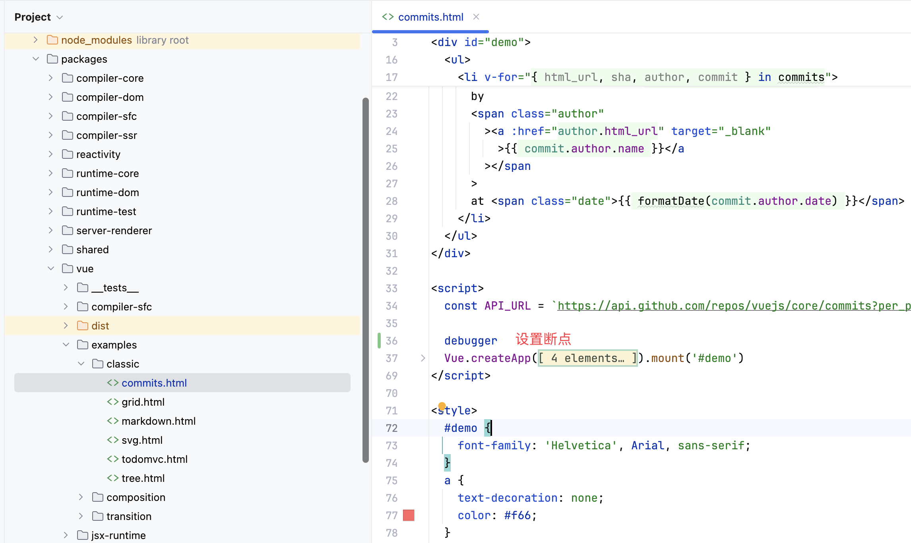
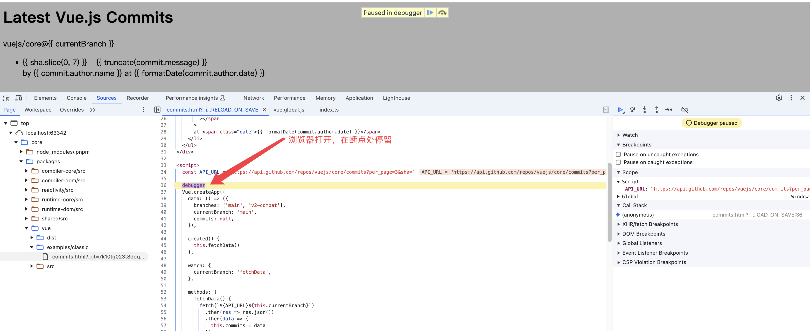
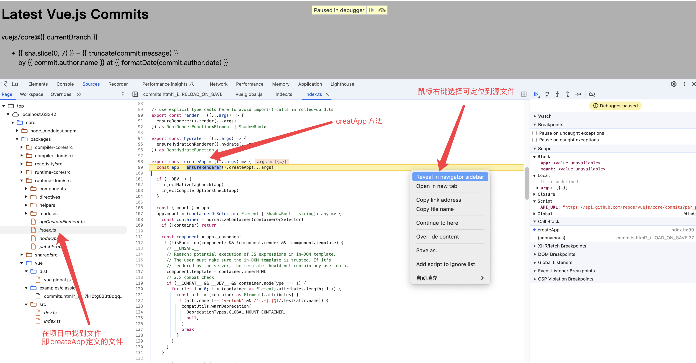

## clone项目

先去github上将项目clone到本地：

```shell
git clone https://github.com/vuejs/core.git
```

在必要情况下可以设置代理进行clone

```shell
git clone -c http.proxy="http://127.0.0.1:1087" https://github.com/vuejs/core.git
```

其中`1087`是代理的端口号, 具体代理可以看 [github 代理设置](/github/proxy)


## 安装依赖

```shell
cd core
pnpm install
```

### 遇到问题

在使用`pnpm install`命令的时候，`pnpm`版本不能太低，太低的话无法安装, 阅读源码的时候`pnpm`版本是`9.12.3`, 最低版本要求可以在`pnpm-lock.yaml`文件第一行配置的`lockfileVersion`查看。

`pnpm install`可能会很久，请耐心等待，有一台电脑卡了差不多10分钟, 不知道是不是网络问题， 另外一台电脑1分钟都不到就安装好了。


## 运行项目

克隆项目，安装依赖之后，由于对整个项目不熟悉，那么先看`README.md`文件，了解一下项目的基本情况，一般有项目运行的方式，可惜这个没有找到，然后我把跟目录下的所有md格式的文件都点开看了一下，也没有找到相关说明

这时不要慌，直接开启搜索大法，直接找到了[如何调试vue3源码](https://www.cnblogs.com/CherishTheYouth/p/CherishTheYouth_20220219.html)这篇文章，好了回归正题， 下面将讲述如何运行vue3源码。

打开`package.json`文件，执行执行`dev`命令：

```shell
pnpm dev
```

当然如果是`Webstorm`的话，直接点击`dev`命令前的运行安妞即可

在控制台输出

```shell
/Users/<username>/.nvm/versions/node/v20.11.0/bin/pnpm run dev

> @3.5.13 dev /Users/<username>/nodeProject/core
> node scripts/dev.js

built: packages/vue/dist/vue.global.js
```

可以看到在`packages/vue/dist`目录下生成了`vue.global.js`文件，这就是编译后的vue3的源码。

## 调试vue3源码

单这样还无法调试vue3源码，我们需要在源码中设置断点，然后运行调试。

打开`packages/vue/examples/`下任意一个文件, 例如`classic/commits.html`, 然后在文件中设置断点，例如在`Vue.createAp`前设置一个断点：



然后在浏览器打开`commits.html`文件，可以看到已经进入断点，可以开始调试了。



通过不断调试，最终可以进入到`Vue.createAp`函数中



在`packages/runtime-dom/src/index.ts`可以看到`createApp`方法

以上，从vue3源码克隆--> 安装依赖 --> 运行项目 --> 调试vue3源码 基本流程介绍完毕。
