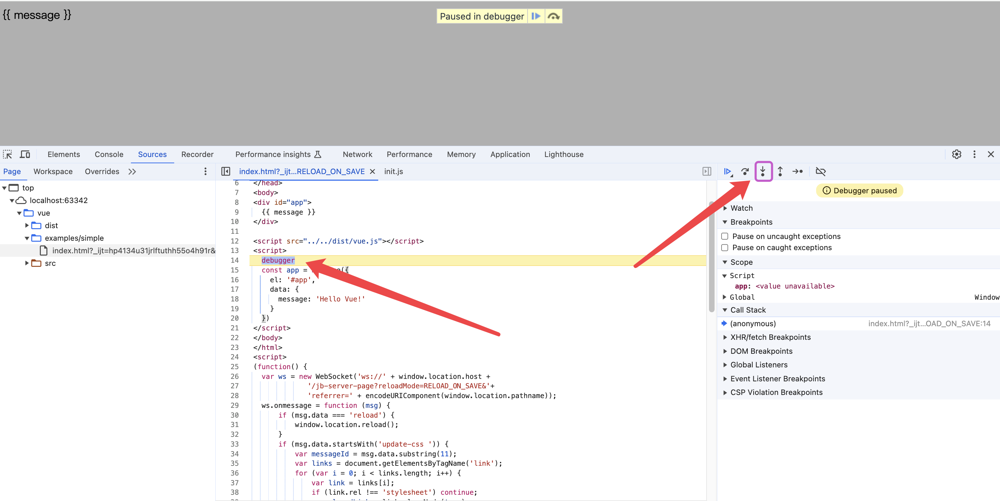

# 源码阅读指南

## 目录结构

简单写一下目录结构，后续待补充

```text
├── benchmarks
├── examples
├── flow
├── packages
├── scripts
├── src
|   ├── compiler    // 编译相关代码, 包括模板编译、样式处理、JSX 转换等
|   ├── core        // 核心代码, 包括渲染、虚拟 DOM、数据响应等
|   ├── platforms   // 平台相关代码, 包括 Web、Weex、小程序等
|   ├── server      // 服务端渲染相关代码
|   ├── sfc         // .vue 文件解析相关代码
|   └── shared      // 共享代码, 包括工具函数、错误处理等
├── test
├── types
└── yarn.lock
```

## 运行

执行`package.json`里面配置的`dev`脚本命令, 在最后面加上`--sourcemap`参数

```json
{
  "scripts": {
    "dev": "rollup -w -c scripts/config.js --environment TARGET:web-full-dev --sourcemap"
  }
}
```

在`example`文件夹下随便创建一个`helloWorld.html`文件, 然后编写一个简单的 vue 案例, 在浏览器打开`helloWorld.html`文件即可

```html
<!DOCTYPE html>
<html lang="en">
  <head>
    <meta charset="UTF-8" />
    <title>Title</title>
  </head>
  <body>
    <div id="app">{{ message }}</div>

    <!--文件路径根据创建位置进行调整即可-->
    <script src="../../dist/vue.js"></script>
    <script>
      const app = new Vue({
        el: '#app',
        data: {
          message: 'Hello Vue!',
        },
      });
    </script>
  </body>
</html>
```

在阅读 vue 源码的时候，然后在对应位置进行`debugger`, 然后根据需要调整`helloWorld.html`文件内容,实现边阅读边调试的效果，
避免直接干读，读的云里雾里

## 调试

还是以之前的`helloWorld.html`文件为例，在 `new Vue()`函数的位置打一个断点，然后刷新浏览器，浏览器会自动进入调试模式，

```html {13}
<!DOCTYPE html>
<html lang="en">
  <head>
    <meta charset="UTF-8" />
    <title>Title</title>
  </head>
  <body>
    <div id="app">{{ message }}</div>

    <!--文件路径根据创建位置进行调整即可-->
    <script src="../../dist/vue.js"></script>
    <script>
      debugger;
      const app = new Vue({
        el: '#app',
        data: {
          message: 'Hello Vue!',
        },
      });
    </script>
  </body>
</html>
```


