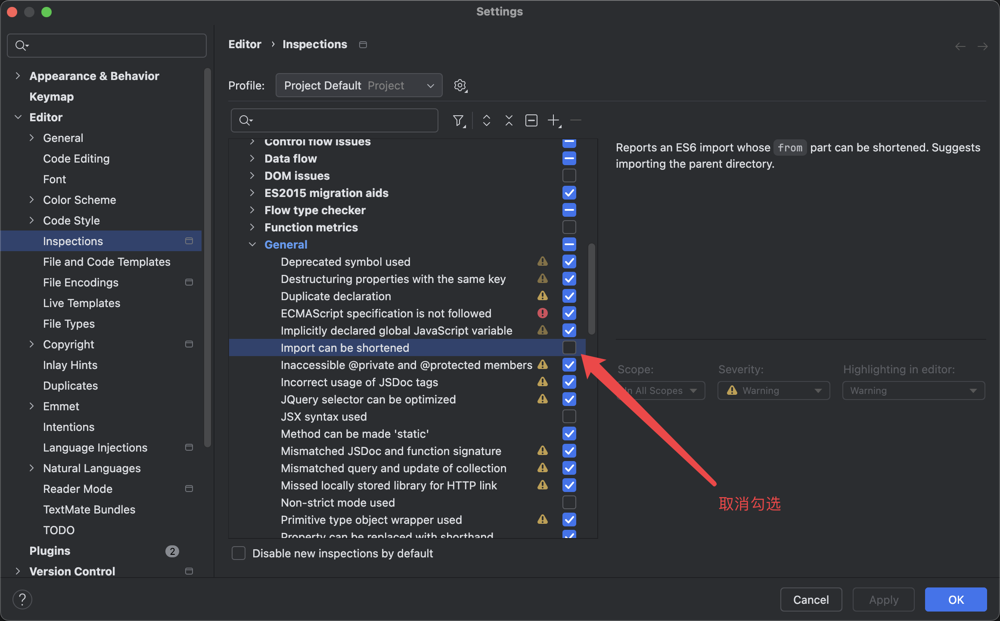
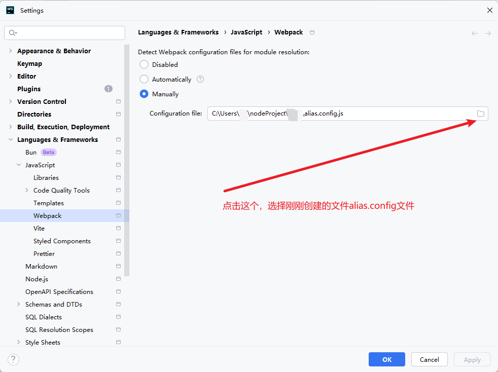

## 自定义配置

## import can be shortened

在一些 monorepo 项目中, 我们在 package 里面在 import 的时候使用相对路径，但是 Webstorm 会推荐使用别名，即绝对路径，不使用就会出现告警，对于强迫症患者来说，太难受了

可以在“File | Settings | Editor | Inspections | JavaScript and TypeScript | General" -> 取消勾选 "Import can be shortened"



## webpack别名

在根目录下创建`alias.config.js`文件，内容如下：

```js
const resolve = dir => require('path').join(__dirname, dir);

module.exports = {
  resolve: {
    alias: {
      '@': resolve('./src')
    }
  }
};
```

:::tip 提示
文件名叫啥都可以, 不一定要叫`alias.config.js`
:::

选择`File -- Settings -- Languages & Frameworks -- JavaScript -- Webpack`, 选择`Manually`, 然后再选择刚刚创建的`alias.config.js`文件


